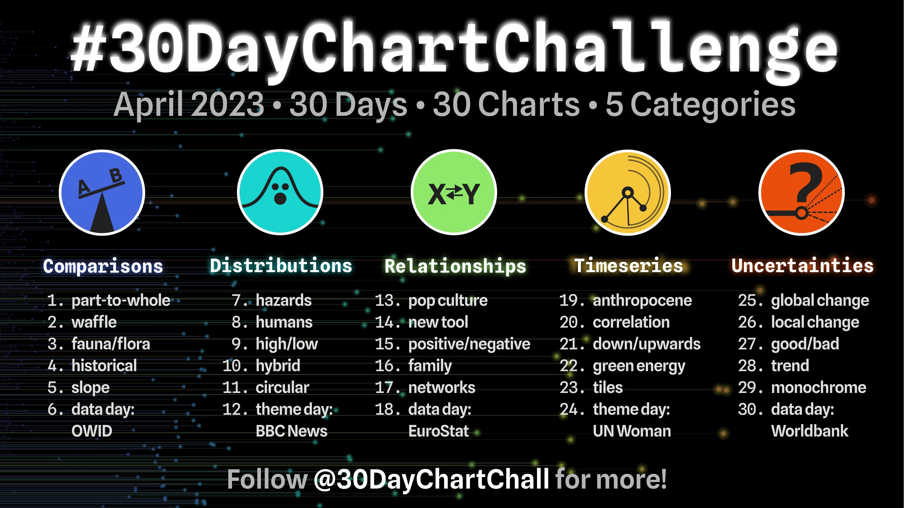
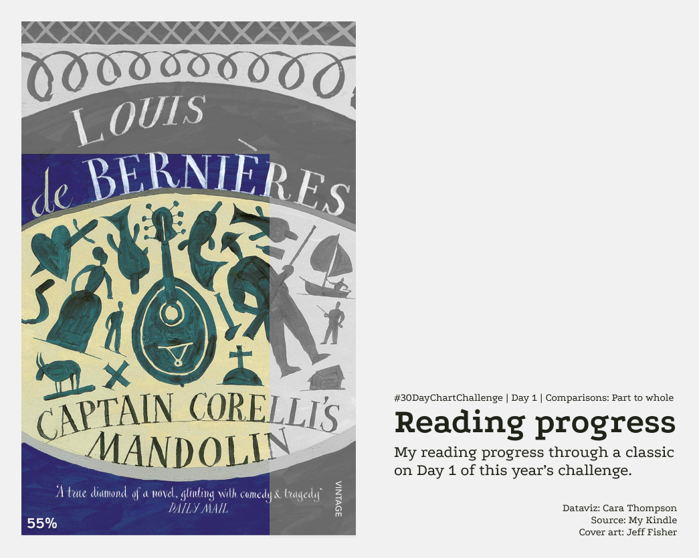
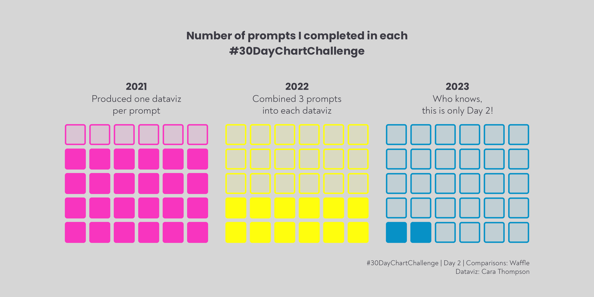
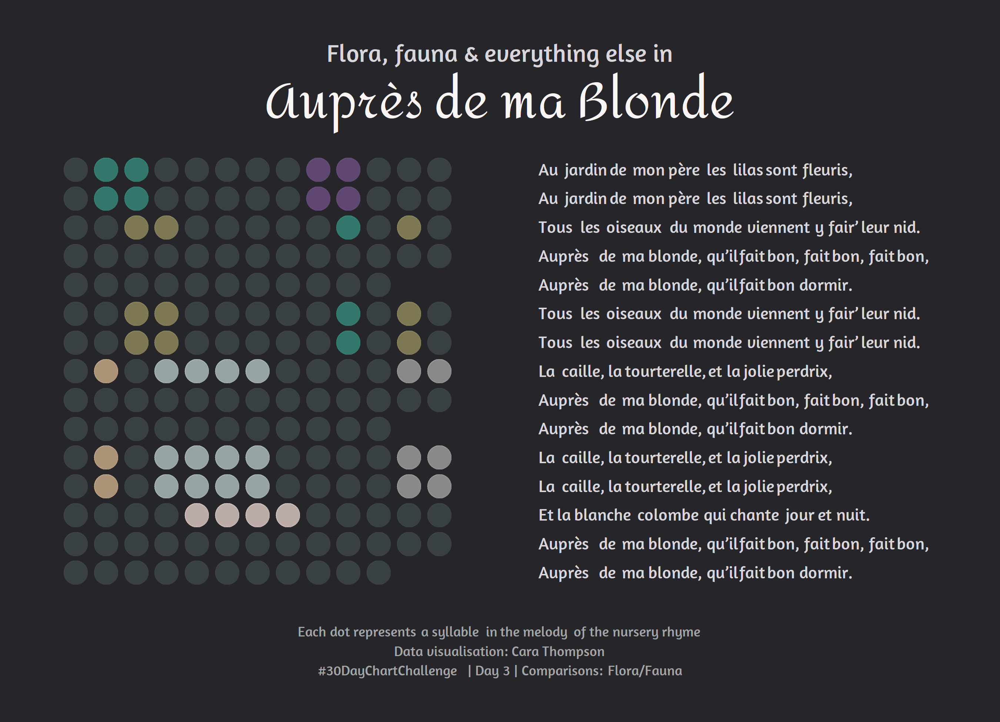
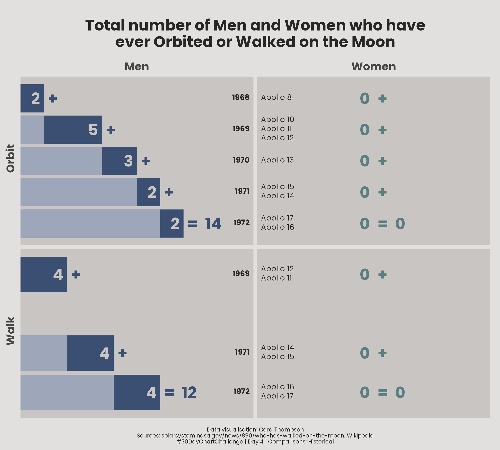
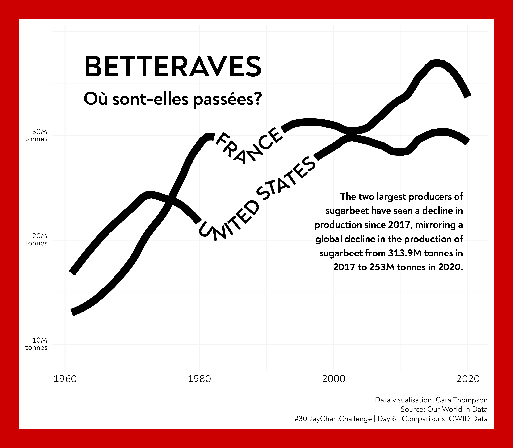

\#30DayChartChallenge contributions - April 2023
================

Welcome to my 2023 \#30DayChartChallenge repo. Clicking on a plot will
take you to the code I wrote to build it, if I built it with R. Happy
browsing, and if you like what you see, [get in
touch](https://twitter.com/cararthompson)!

## Comparisons

### Day 1 - Part to whole - 🛠️ Figma

### Day 2 - Waffle - 🛠️ RStats

### Day 3 - Fauna/Flora - 🛠️ RStats

### Day 4 - Historical - 🛠️ RStats

### Day 5 - Slope - 🛠️ RStats

## Day 6 - OWID data - 🛠️ RStats

